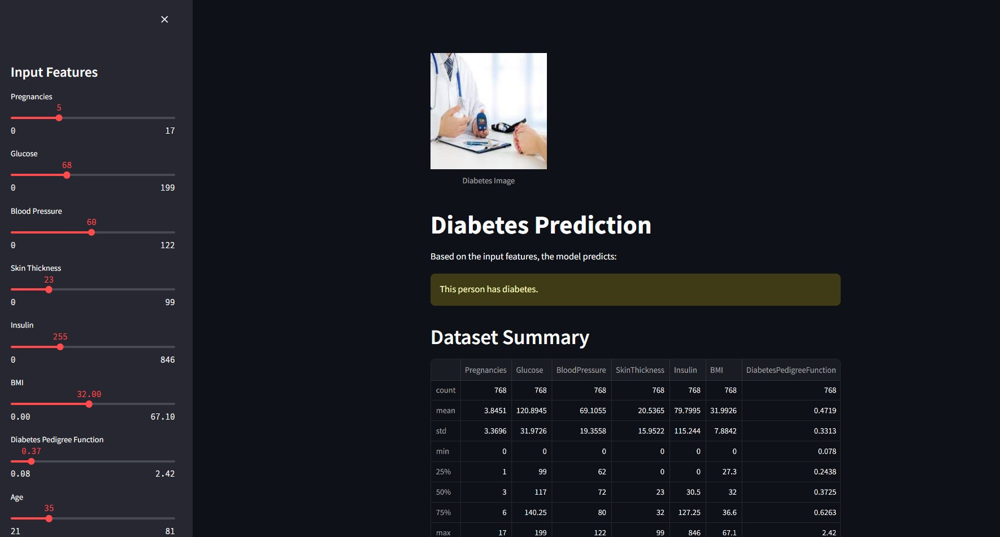
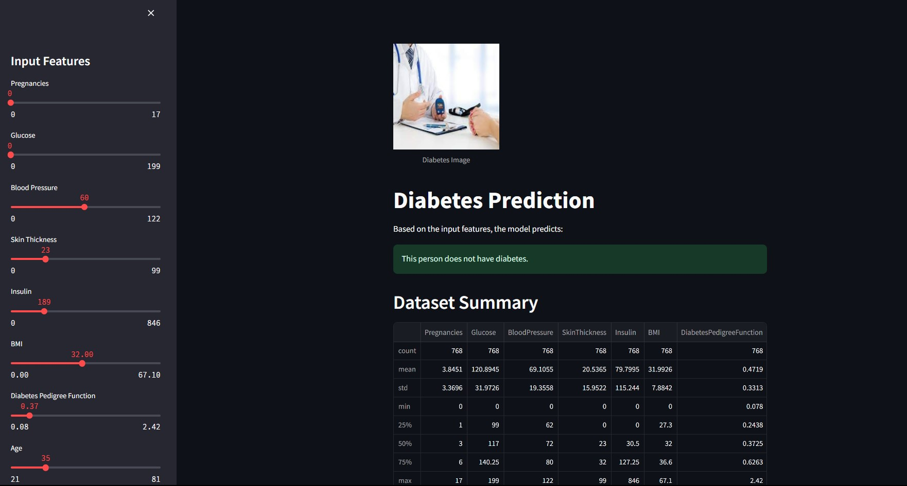

# Diabetes Disease Prediction

Diabetes is a prevalent and chronic disease affecting millions of people worldwide. Early detection and prediction of diabetes can significantly improve patient outcomes and quality of life. This project focuses on predicting diabetes disease using Support Vector Machine (SVM), a powerful machine learning algorithm known for its effectiveness in classification tasks.

## Importance of Predicting Diabetes

Predicting diabetes disease is crucial for several reasons:

- **Early Intervention:** Early detection allows for timely intervention and management of diabetes, reducing the risk of complications.
- **Personalized Treatment:** Predictive models can help healthcare professionals tailor treatment plans based on individual patient risks and characteristics.
- **Improved Health Outcomes:** By predicting diabetes early, patients can adopt lifestyle changes and preventive measures to manage their condition effectively.

## Support Vector Machine (SVM)

Support Vector Machine (SVM) is a supervised learning algorithm used for classification tasks. It works by finding the optimal hyperplane that separates data points into different classes while maximizing the margin between classes. SVM is particularly effective for binary classification problems like predicting whether a person has diabetes or not based on certain features.

## Overview

The SVM model predicts diabetes disease based on the following parameters:

- Pregnancies
- Glucose
- Blood Pressure
- Skin Thickness
- Insulin
- BMI
- Diabetes Pedigree Function
- Age

## Front End Using Streamlit

The front end provides a user-friendly interface using Streamlit, allowing users to input parameter values using slicers. The model then predicts whether the person is likely to have diabetes or not.

*Screenshot: Predicted with Diabetes*

*Screenshot: Predicted Not Having Diabetes*
